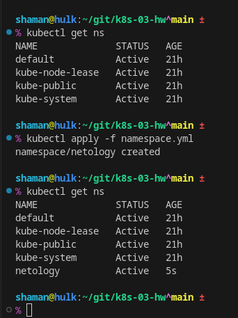
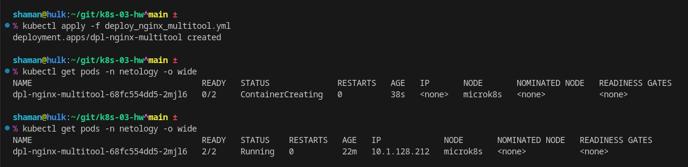
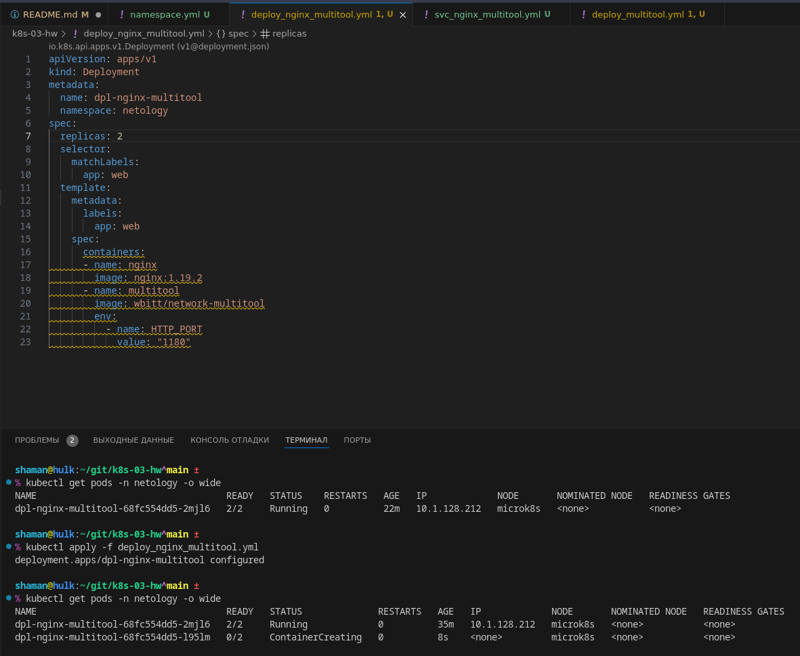
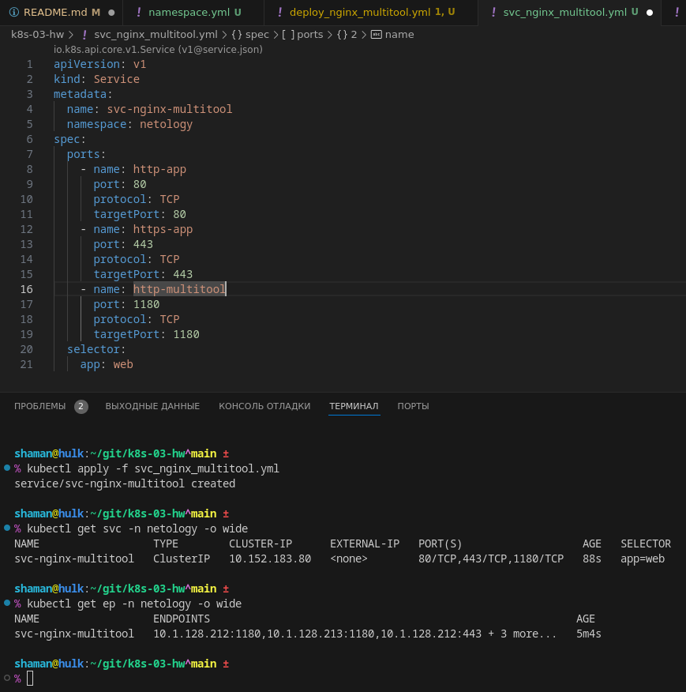
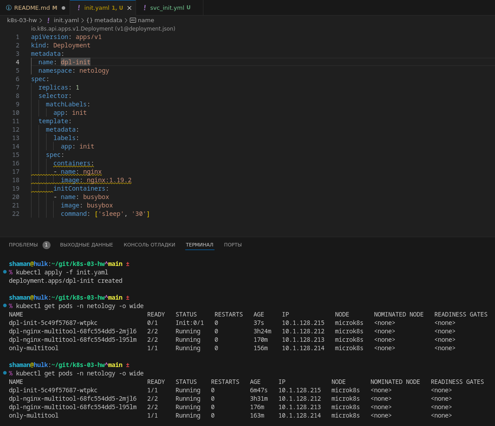
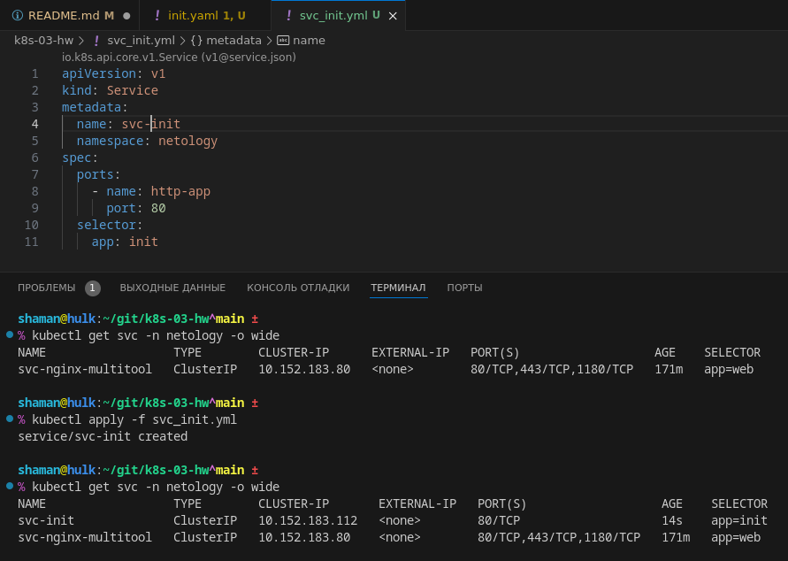
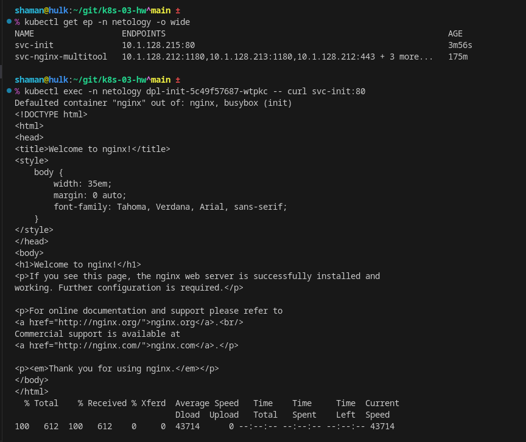

# Домашнее задание к занятию «`Запуск приложений в K8S`» - `Живарев Игорь`

### Цель задания

В тестовой среде для работы с Kubernetes, установленной в предыдущем ДЗ, необходимо развернуть Deployment с приложением, состоящим из нескольких контейнеров, и масштабировать его.

------

### Чеклист готовности к домашнему заданию

1. Установленное k8s-решение (например, MicroK8S).
2. Установленный локальный kubectl.
3. Редактор YAML-файлов с подключённым git-репозиторием.

------

### Инструменты и дополнительные материалы, которые пригодятся для выполнения задания

1. [Описание](https://kubernetes.io/docs/concepts/workloads/controllers/deployment/) Deployment и примеры манифестов.
2. [Описание](https://kubernetes.io/docs/concepts/workloads/pods/init-containers/) Init-контейнеров.
3. [Описание](https://github.com/wbitt/Network-MultiTool) Multitool.

------

### Задание 1. Создать Deployment и обеспечить доступ к репликам приложения из другого Pod

1. Создать Deployment приложения, состоящего из двух контейнеров — nginx и multitool. Решить возникшую ошибку.
2. После запуска увеличить количество реплик работающего приложения до 2.
3. Продемонстрировать количество подов до и после масштабирования.
4. Создать Service, который обеспечит доступ до реплик приложений из п.1.
5. Создать отдельный Pod с приложением multitool и убедиться с помощью `curl`, что из пода есть доступ до приложений из п.1.

------

### Задание 2. Создать Deployment и обеспечить старт основного контейнера при выполнении условий

1. Создать Deployment приложения nginx и обеспечить старт контейнера только после того, как будет запущен сервис этого приложения.
2. Убедиться, что nginx не стартует. В качестве Init-контейнера взять busybox.
3. Создать и запустить Service. Убедиться, что Init запустился.
4. Продемонстрировать состояние пода до и после запуска сервиса.

------

### Правила приема работы

1. Домашняя работа оформляется в своем Git-репозитории в файле README.md. Выполненное домашнее задание пришлите ссылкой на .md-файл в вашем репозитории.
2. Файл README.md должен содержать скриншоты вывода необходимых команд `kubectl` и скриншоты результатов.
3. Репозиторий должен содержать файлы манифестов и ссылки на них в файле README.md.

---


## Ответ


### Задание 1. Создать Deployment и обеспечить доступ к репликам приложения из другого Pod

1. Создание пространства имён  


Листинг Deployment:
```
apiVersion: apps/v1
kind: Deployment
metadata:
  name: dpl-nginx-multitool
  namespace: netology
spec:
  replicas: 1
  selector:
    matchLabels:
      app: web
  template:
    metadata:
      labels:
        app: web
    spec:
      containers:
      - name: nginx
        image: nginx:1.19.2
      - name: multitool
        image: wbitt/network-multitool
        env:
          - name: HTTP_PORT
            value: "1180"
```
Для решения ошибки использован порт `1180`.

Запускаем `Deployment` и проверяем создание `pod`


Запросы контейнерам в `pod`
```
shaman@hulk:~
% kubectl exec -n netology dpl-nginx-multitool-68fc554dd5-2mjl6 -- curl localhost:1180
Defaulted container "nginx" out of: nginx, multitool
  % Total    % Received % Xferd  Average Speed   Time    Time     Time  Current
                                 Dload  Upload   Total   Spent    Left  Speed
100   155  100   155    0     0   4843      0 --:--:-- --:--:-- --:--:--  4696
WBITT Network MultiTool (with NGINX) - dpl-nginx-multitool-68fc554dd5-2mjl6 - 10.1.128.212 - HTTP: 1180 , HTTPS: 443 . (Formerly praqma/network-multitool)

shaman@hulk:~
% kubectl exec -n netology dpl-nginx-multitool-68fc554dd5-2mjl6 -- curl localhost:80                                                      24-06-09 - 13:56:30
Defaulted container "nginx" out of: nginx, multitool
<!DOCTYPE html>
<html>
<head>
<title>Welcome to nginx!</title>
<style>
    body {
        width: 35em;
        margin: 0 auto;
        font-family: Tahoma, Verdana, Arial, sans-serif;
    }
</style>
</head>
<body>
<h1>Welcome to nginx!</h1>
<p>If you see this page, the nginx web server is successfully installed and
working. Further configuration is required.</p>

<p>For online documentation and support please refer to
<a href="http://nginx.org/">nginx.org</a>.<br/>
Commercial support is available at
<a href="http://nginx.com/">nginx.com</a>.</p>

<p><em>Thank you for using nginx.</em></p>
</body>
</html>
  % Total    % Received % Xferd  Average Speed   Time    Time     Time  Current
                                 Dload  Upload   Total   Spent    Left  Speed
100   612  100   612    0     0   597k      0 --:--:-- --:--:-- --:--:--  597k

shaman@hulk:~
% kubectl exec -n netology dpl-nginx-multitool-68fc554dd5-2mjl6 -- curl localhost:443                                                     24-06-09 - 13:57:41
Defaulted container "nginx" out of: nginx, multitool
<html>
<head><title>400 The plain HTTP request was sent to HTTPS port</title></head>
<body>
<center><h1>400 Bad Request</h1></center>
<center>The plain HTTP request was sent to HTTPS port</center>
<hr><center>nginx/1.24.0</center>
</body>
</html>
  % Total    % Received % Xferd  Average Speed   Time    Time     Time  Current
                                 Dload  Upload   Total   Spent    Left  Speed
100   255  100   255    0     0  25500      0 --:--:-- --:--:-- --:--:-- 28333
```

2. Увеличиваем колличество реплик и перезапускаем `Deployment`



4. Создание сервиса


5. Создать отдельный Pod с приложением multitool и убедиться с помощью curl, что из пода есть доступ до приложений из п.1.


```
shaman@hulk:~/git/k8s-03-hw^main ±
% kubectl exec -n netology only-multitool -- curl svc-nginx-multitool:80                                                                                              24-06-09 - 14:22:14
  % Total    % Received % Xferd  Average Speed   Time    Time     Time  Current
                                 Dload  Upload   Total   Spent    Left  Speed
100   612  100   612    0     0    507      0  0:00:01  0:00:01 --:--:--   507
<!DOCTYPE html>
<html>
<head>
<title>Welcome to nginx!</title>
<style>
    body {
        width: 35em;
        margin: 0 auto;
        font-family: Tahoma, Verdana, Arial, sans-serif;
    }
</style>
</head>
<body>
<h1>Welcome to nginx!</h1>
<p>If you see this page, the nginx web server is successfully installed and
working. Further configuration is required.</p>

<p>For online documentation and support please refer to
<a href="http://nginx.org/">nginx.org</a>.<br/>
Commercial support is available at
<a href="http://nginx.com/">nginx.com</a>.</p>

<p><em>Thank you for using nginx.</em></p>
</body>
</html>

shaman@hulk:~/git/k8s-03-hw^main ±
% kubectl exec -n netology only-multitool -- curl svc-nginx-multitool:443                                                                                             24-06-09 - 14:23:55
  % Total    % Received % Xferd  Average Speed   Time    Time     Time  Current
                                 Dload  Upload   Total   Spent    Left  Speed
100   255  100   255    0     0  37794      0 --:--:-- --:--:-- --:--:-- 42500
<html>
<head><title>400 The plain HTTP request was sent to HTTPS port</title></head>
<body>
<center><h1>400 Bad Request</h1></center>
<center>The plain HTTP request was sent to HTTPS port</center>
<hr><center>nginx/1.24.0</center>
</body>
</html>

shaman@hulk:~/git/k8s-03-hw^main ±
% kubectl exec -n netology only-multitool -- curl svc-nginx-multitool:1180                                                                                            24-06-09 - 14:24:59
WBITT Network MultiTool (with NGINX) - dpl-nginx-multitool-68fc554dd5-l95lm - 10.1.128.213 - HTTP: 1180 , HTTPS: 443 . (Formerly praqma/network-multitool)
  % Total    % Received % Xferd  Average Speed   Time    Time     Time  Current
                                 Dload  Upload   Total   Spent    Left  Speed
100   155  100   155    0     0  26947      0 --:--:-- --:--:-- --:--:-- 31000
```


### Задание 2. Создать Deployment и обеспечить старт основного контейнера при выполнении условий

1. Запускаем Deployment



3. Создаие и запуск Service



4. Проверяем состояние `endpoint` и доступность `pod` через `service`
``

---